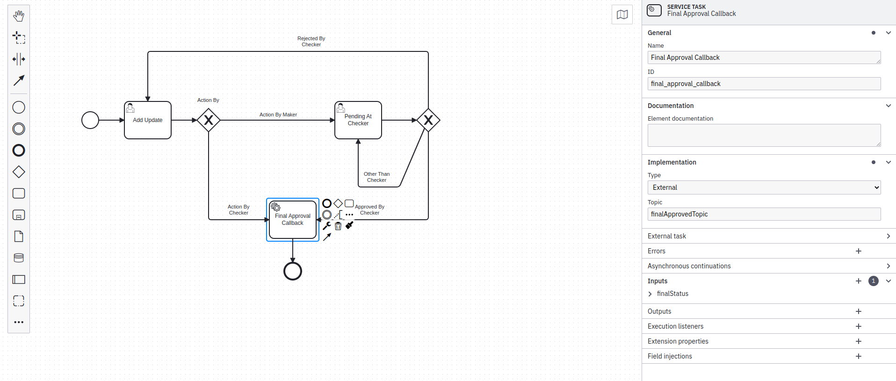

# Camunda-NodeJs-Operator

This app will connect your application with Camunda-BPMN and simplify the connection.

## Acknowledgements

 - Upload Camunda BPMN workflow
 - your system will call this node operater to complete the task.
 - Node operater will call the Camunda to complete the task.
 - Node operater will give call back to your system for next pending task if exists.
 - If the workflow is completed and no more pending task then Node operater will notify your system using webhook.
    - You have to create Service Task for each end event. Please check the image below.
    - Subscribe the Service Task topic in Node operater
    - I have added in index.js file you may add anywhere you like.

